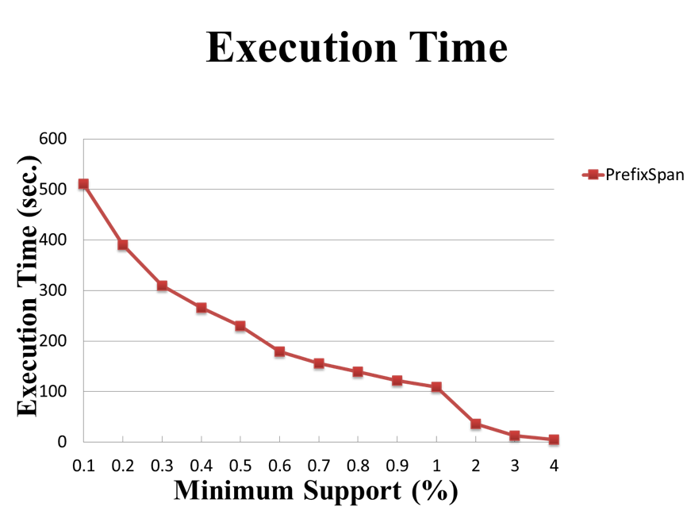

# Sequential Pattern Mining: PrefixSpan

Python implementation of PrefixSpan (a practice)

## 程式執行介面

輸入以下指令到命令提示字元：

```sh
$ java -jar PrefixSpan.jar [dataset file path] [minimum support]
```

若需要將找到的結果輸出到一個文字檔中，則須加上 `> [output file]`：

```sh
$ java -jar PrefixSpan.jar ... > [output file]
```
## 實驗數據圖表

### 以 `C50S10T2.5N10000.ascii` 做為資料集輸入


### 以 `C50S10T5N10000.ascii` 做為資料集輸入




